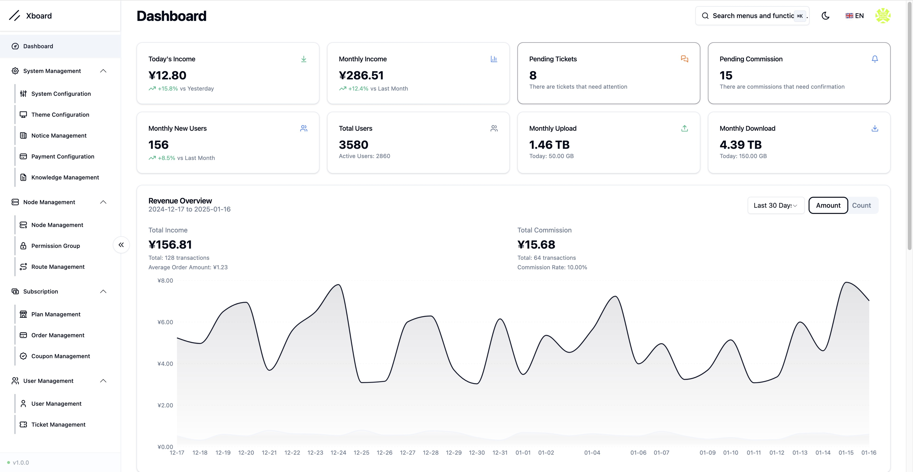
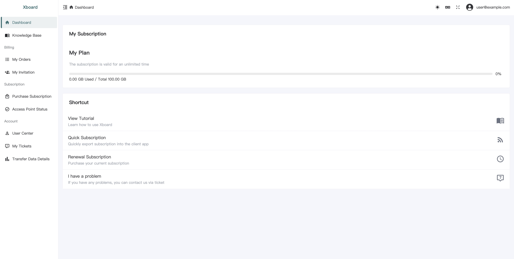

# Xboard Plus

<div align="center">

[](https://t.me/XboardOfficial)


[](LICENSE)

</div>

## 📖 Introduction

Xboard Plus is a modern panel system built on Laravel 12, focusing on providing a clean and efficient user experience.

## ✨ Features

- 🚀 Built with Laravel 12 + Octane for significant performance gains
- 🎨 React 19 admin interface powered by shadcn/ui
- 📱 React 19 user frontend powered by shadcn/ui and TypeScript
- 🐳 Ready-to-use Docker deployment solution
- 🎯 Optimized system architecture for better maintainability

## 🚀 Quick Start

```bash
git clone --depth 1 https://github.com/xboardnext999/Xboard-Plus.git && \
cd Xboard-Plus && \
cp compose.sample.yaml compose.yaml && \
docker compose build --build-arg CACHEBUST=$(date +%s) xboard && \
docker compose run -it --rm \
    -e ENABLE_SQLITE=true \
    -e ENABLE_REDIS=true \
    -e ADMIN_ACCOUNT=admin@demo.com \
    xboard php artisan xboard:install && \
docker compose up -d
```

> After installation, visit: http://SERVER_IP:8002
> ⚠️ Make sure to save the admin credentials shown during installation

## 📖 Documentation

### 🔄 Upgrade Notice
> 🚨 **Important:** This version involves significant changes. Please strictly follow the upgrade documentation and backup your database before upgrading. Note that upgrading and migration are different processes, do not confuse them.

### Development Guides
- [Plugin Development Guide](./docs/en/development/plugin-development-guide.md) - Complete guide for developing Xboard Plus plugins

### Deployment Guides
- [Deploy with 1Panel](./docs/en/installation/1panel.md)
- [Deploy with Docker Compose](./docs/en/installation/docker-compose.md)
- [Deploy with aaPanel](./docs/en/installation/aapanel.md)
- [Deploy with aaPanel + Docker](./docs/en/installation/aapanel-docker.md) (Recommended)

### Migration Guides
- [Migrate from v2board dev](./docs/en/migration/v2board-dev.md)
- [Migrate from v2board 1.7.4](./docs/en/migration/v2board-1.7.4.md)
- [Migrate from v2board 1.7.3](./docs/en/migration/v2board-1.7.3.md)

## 🛠️ Tech Stack

- Backend: Laravel 12 + Octane
- Admin Panel: React 19 + shadcn/ui + Tailwind CSS
- User Frontend: React 19 + shadcn/ui + TypeScript + TanStack Query
- Deployment: Docker + Docker Compose
- Caching: Redis + Octane Cache

## 📷 Preview




## ⚠️ Disclaimer

This project is for learning and communication purposes only. Users are responsible for any consequences of using this project.

## ❤️ Support The Project

If this project has helped you, donations are appreciated. They help support ongoing maintenance and would make me very happy.

TRC20: `TLypStEWsVrj6Wz9mCxbXffqgt5yz3Y4XB`

## 🌟 Maintenance Notice

This project is currently under light maintenance. We will:
- Fix critical bugs and security issues
- Review and merge important pull requests
- Provide necessary updates for compatibility

However, new feature development may be limited.

## 🔔 Important Notes

1. Restart required after modifying admin path:
```bash
docker compose restart
```

2. For aaPanel installations, restart the Octane daemon process

## 🤝 Contributing

Issues and Pull Requests are welcome to help improve the project.

## 📈 Star History

[](https://starchart.cc/xboardnext999/Xboard-Plus)
